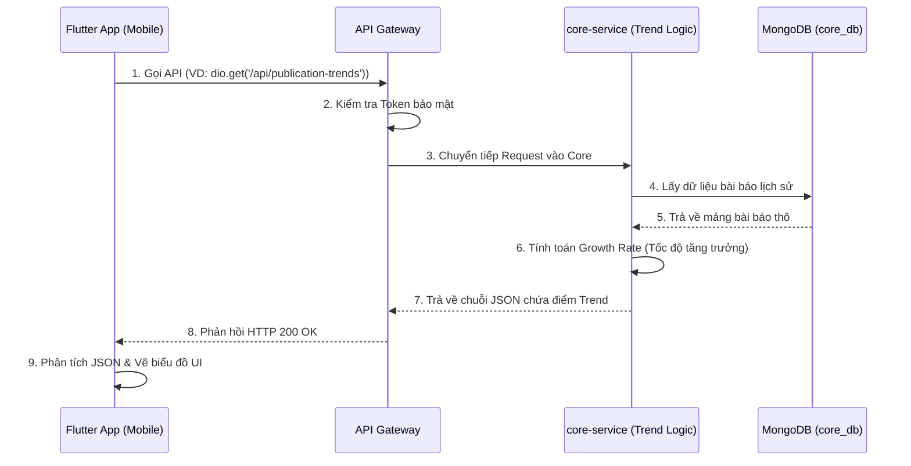

# GIẢI THÍCH CHI TIẾT CHỨC NĂNG TREND (XU HƯỚNG) TRONG DỰ ÁN 
*(Tích hợp luồng từ Flutter App đến Backend Microservices)*

---

## 1. Mục đích của chức năng Trend trong dự án này là gì?
Trong hệ thống **Scientific Journal Trend Tracker**, chức năng Trend sinh ra để giúp các nhà nghiên cứu, sinh viên biết được:
- Từ khóa (Keywords) nào đang được nhắc đến nhiều nhất trong các bài báo gần đây?
- Các chủ đề (Topics) mới nổi (Emerging) đang gia tăng đột biến về số lượng bài viết là gì?
- Sự thay đổi về mức độ quan tâm của một chủ đề khoa học theo từng năm.

---

## 2. Luồng hoạt động (Từ Flutter App xuống Backend)

Quá trình xem bảng xếp hạng hoặc biểu đồ Trend trên điện thoại diễn ra như sau:



---

## 3. Mối liên kết ở Frontend (Flutter App)

Ở phía Frontend (App Mobile), Flutter không thực hiện bất kỳ vòng lặp tính toán nặng nề nào. Trách nhiệm của Flutter chỉ là **hiển thị (Rendering)**.

- **Gọi API & Quản lý trạng thái (State):** Flutter sử dụng thư viện gọi mạng (như `http` hoặc `dio`) để kết nối với API Gateway. Các State Management (như `Provider`, `Bloc`, hoặc `GetX`) sẽ hứng dữ liệu JSON trả về.
- **Vẽ Biểu đồ (Charting):** Khi nhận được danh sách `trendsMap` (dữ liệu từng năm), Flutter sẽ đưa dữ liệu này vào các thư viện biểu đồ (như `fl_chart` hoặc `syncfusion_flutter_charts`) để vẽ đường line graph hoặc bar chart.
- **Xử lý Null/Crash:** Điểm cộng lớn của Backend là đã xử lý sẵn các trường hợp năm không có bài báo (trả về giá trị `0`). Nhờ đó, Flutter App chỉ cần đọc Data và vẽ, không sợ văng lỗi `NullPointer` hay màn hình đỏ lòm (Red Screen of Death) do thiếu field dữ liệu.

---

## 4. Trách nhiệm của Backend (Node.js & Microservices)

Backend gánh 100% logic tính toán. Quá trình xử lý diễn ra tại `core-service` với các Component chính:

### A. Tầng Controller (`PublicationTrendController`)
Nơi hứng request từ Flutter. Nó nhận các tham số (query parameters) như `limit`, `page`, hoặc tên keyword mà người dùng muốn lọc. Sau đó, truyền xuống tầng Service.

### B. Tầng Service (`TrendAnalyzerService` & `PublicationTrendService`)
Đây là "trái tim" của chức năng. Quá trình tính toán diễn ra theo các bước:
1. **Khởi tạo Map:** Tạo một đối tượng Object/Map rỗng để lưu trữ.
2. **Lặp (Looping):** Duyệt qua hàng nghìn bài báo lấy từ MongoDB.
3. **Bóc tách:** Ở mỗi bài báo, trích xuất thuộc tính `Year` (Năm đăng) và mảng `Keywords` (Từ khóa).
4. **Cộng dồn:** Cộng giá trị đếm vào Map theo cấu trúc: `Map[Năm][Từ Khóa] += 1`.
5. **Tính toán tăng trưởng (Growth Rate):** So sánh `paperCount` (số lượng năm nay) với `previousCount` (số lượng năm ngoái). Nếu công thức `((nay - ngoái)/ngoái)*100` ra kết quả > 20%, hệ thống tự động gán cờ `isTrending = true` (Đang hot) hoặc `isEmerging = true` (Mới nổi).

### C. Tầng Database (MongoDB - `core_db`)
Chứa các bảng/collections liên quan. Việc dùng MongoDB (NoSQL) rất phù hợp vì các bài báo khoa học có cấu trúc linh hoạt (số lượng tác giả, tags, từ khóa không cố định). Trong tương lai, nếu số lượng bài báo quá khổng lồ, logic vòng lặp ở Tầng Service sẽ được dời xuống thành **Aggregation Pipeline** của MongoDB để Database tự tính toán và cộng dồn, giúp giảm tải bộ nhớ RAM cho Node.js Server.

---

## 5. Giá trị thực tiễn & Trải nghiệm người dùng (UX) của chức năng Trend

Chức năng Trend không chỉ là một thuật toán chạy ngầm ở Backend, mà nó mang lại giá trị cốt lõi rất lớn cho người dùng cuối (End-users) khi trải nghiệm trên Flutter App:

### A. Đối với Nhà nghiên cứu / Sinh viên (Researchers/Students)
- **Tiết kiệm thời gian tìm kiếm:** Thay vì phải bới móc hàng nghìn bài báo để biết dạo này mọi người đang nghiên cứu về cái gì (VD: AI, Blockchain, hay IoT), người dùng chỉ cần mở App là thấy ngay bảng xếp hạng **Top Trending Keywords**.
- **Định hướng đề tài tốt hơn:** Thông qua thuật toán **Emerging (Mới nổi)** (tăng trưởng >20%), sinh viên có thể đoán được chủ đề nào đang "bắt đầu hot" để kịp thời chọn làm đề tài đồ án tốt nghiệp mà không sợ bị lỗi thời.

### B. Đối với Quản trị viên (Admin/Reviewers)
- **Ra quyết định đăng bài:** Giúp ban biên tập tạp chí khoa học biết được chủ đề nào đang thu hút sự quan tâm của cộng đồng, từ đó ưu tiên duyệt hoặc đặt hàng các bài viết thuộc chủ đề đó để tăng lượt View, lượt Trích dẫn (Citation).

### C. Hiển thị trực quan (Visualizing Data)
Thay vì hiển thị các con số khô khan, App Flutter cung cấp trải nghiệm phân tích tuyệt vời thông qua **Biểu đồ (Line Chart / Bar Chart)**:
- Người dùng có thể nhìn thấy sự lên xuống của một từ khóa qua từng năm (VD: Từ khóa "COVID-19" tăng vọt năm 2021 nhưng giảm mạnh vào 2023).
- **Skeleton / Circular Loading:** Trong lúc chờ Backend tính toán hàng nghìn bài báo, App không hề bị đơ mà hiển thị hiệu ứng Loading thân thiện, mang lại cảm giác mượt mà (Smooth UX) theo chuẩn ứng dụng di động hiện đại.

---

## 6. Thiết kế Cơ sở dữ liệu (Database Schema) cho chức năng Trend

Để phục vụ cho tính năng này hoạt động mượt mà, Database MongoDB đóng vai trò cực kỳ quan trọng. Hệ thống không sử dụng các bảng `JOIN` phức tạp như SQL mà dựa trên các Collection linh hoạt:

### A. Collection: `Publications` (Bài báo gốc)
Đây là nguồn dữ liệu thô (Raw Data) để hệ thống lấy ra tính toán Trend. Mỗi Document lưu trữ:
- `_id`: Mã bài báo.
- `title`: Tiêu đề bài báo.
- `publishDate`: Ngày xuất bản (Được hệ thống trích xuất `Year` để gom nhóm).
- `keywords`: Mảng các từ khóa (Ví dụ: `["Machine Learning", "Healthcare", "AI"]`).
- `views` / `citations`: Lượt xem và lượt trích dẫn (Có thể kết hợp làm hệ số nhân để tính điểm Trend phức tạp hơn sau này).

**Tối ưu hóa (Indexing):** Để tăng tốc độ quét dữ liệu, hệ thống được đề xuất đánh **Chỉ mục (Index)** trên trường `publishDate` và `keywords`. Giúp DB không phải quét toàn bộ bảng (Full Scan) mà nhảy thẳng tới dữ liệu thông qua cấu trúc cây B-Tree.

### B. Collection (Mở rộng): `PublicationTrends` (Bảng Cache / Lưu trữ kết quả)
Nếu mỗi lần User vào App đều bắt Server Node.js quét hàng ngàn bài báo ở Collection `Publications` để vòng lặp chạy lại từ đầu thì hệ thống rất dễ bị sập vì đầy RAM (Out of Memory) và phản hồi rất chậm.

Giải pháp tối ưu là tạo thêm Collection `PublicationTrends` làm nơi chứa kết quả đã tính sẵn. Cấu trúc lưu trữ:
```json
{
  "keyword": "Artificial Intelligence",
  "year": 2023,
  "totalArticles": 150,
  "growthRate": 25.5,
  "isTrending": true,
  "isEmerging": false,
  "lastUpdated": "2023-10-15T00:00:00Z"
}
```
**Cách thức vận hành:**
- Hệ thống thiết lập một **Cronjob (Tác vụ chạy ngầm)** vào nửa đêm. Cronjob sẽ tổng hợp dữ liệu, chạy thuật toán tính Trend và lưu chốt kết quả vào Collection `PublicationTrends`.
- Khi App Flutter gọi API lấy danh sách Trend, Backend chỉ việc bốc thẳng dữ liệu đã tính sẵn từ Collection này và ném về cho App (độ phức tạp O(1)).
- Việc này giúp tốc độ phản hồi API cực kỳ chớp nhoáng (vài chục mili-giây), mang lại trải nghiệm hoàn hảo cho người dùng.

---

## 7. Kiến trúc Microservices & Triển khai Docker cho chức năng Trend

Để hệ thống chịu tải tốt và dễ bảo trì, chức năng Trend được đặt trong một hệ sinh thái hiện đại:

### A. Vai trò của Microservices
Toàn bộ logic đếm và phân tích Trend được cô lập hoàn toàn vào một service duy nhất mang tên **`core-service`**.
- **Chống sập chéo (Isolate Failure):** Việc chạy vòng lặp tính toán hàng vạn bài báo rất ngốn CPU. Nhờ kiến trúc Microservices, nếu `core-service` bị quá tải (Overload) do đếm Trend, thì các service khác như Đăng nhập (`auth-service`) hay Thanh toán vẫn sống khỏe, khách hàng vẫn vào App bình thường.
- **Dễ dàng mở rộng (Scale-out):** Khi dữ liệu bài báo tăng đột biến, quản trị viên chỉ cần cấp thêm RAM/CPU (hoặc nhân bản) riêng cho container của `core-service` thay vì phải chi bộn tiền nâng cấp toàn bộ hệ thống.
- **Giao tiếp nội bộ (Inter-service Communication):** Nếu chức năng Trend muốn lấy thêm điểm "Lượt Xem" (Views) vốn đang nằm ở một Service khác (`interaction-service`), nó không thể chọc thẳng vào DB của người khác được. Thay vào đó, `core-service` sẽ gọi một API nội bộ hoặc bắn lệnh qua Message Queue (RabbitMQ) để xin số liệu một cách bảo mật.

### B. Triển khai bằng Docker (Containerization)
Mỗi service được đóng gói gọn gàng bằng Docker để đảm bảo chạy mượt trên mọi môi trường (Máy dev, Staging, Production).

- **Multi-stage Build & Bản Alpine siêu nhẹ:** File `Dockerfile` sử dụng Image `node:18-alpine` (rất nhẹ và bảo mật). Docker sẽ Build mã nguồn TypeScript thành JavaScript, sau đó vứt bỏ hoàn toàn mã nguồn gốc và chỉ giữ lại thư mục `dist/` trên Production. Điều này giúp khởi động container cực nhanh và **bảo mật tuyệt đối** mã nguồn.
- **Cơ chế Tự cứu hộ (Restart Policy):** Trong file `docker-compose.yml`, chức năng Trend được gài lệnh `restart: unless-stopped`. Lỡ trong lúc đếm Trend bị tràn bộ nhớ gây Crash (sập App), Docker sẽ lập tức "dựng đầu" service dậy chạy lại chỉ trong 1 giây, giúp hệ thống tự phục hồi (Self-healing).
- **API Gateway làm bảo vệ:** Người dùng cuối không thể trực tiếp gọi vào hàm tính Trend. Họ phải đi qua một cánh cổng gọi là API Gateway. Tại đây, hệ thống sẽ thực hiện kiểm tra Token JWT và đếm số lượng Request (Rate Limit) để đề phòng hacker xài Tool spam làm cháy Server.
